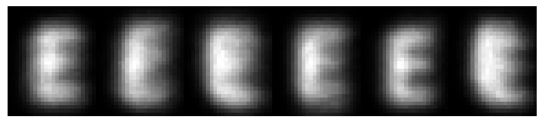
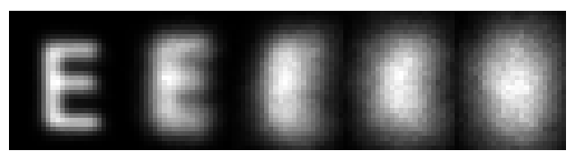

# Turbulence-Degraded-Characters
A imagery database for machine learning experiments, atmospheric turbulence characterization, and turbulence restoration research.

The TDC database is suitable for machine learning experiments, atmospheric turbulence characterization, and turbulence restoration research. The imagery is generated using the brightness function [1] method of turbulence simulation as implemented in the WONAT library (https://www.optonicus.com/portfolio/wavefront-beam-control-techniques/). The imaging scenario is defined by a 100 mm aperture telescope imaging a 550 mm wide square field over a range of 1 km.  The wavelength of the simulation is set to 550 nm.   The sample spacing in the object plane is 2.75 mm corresponding to critical sampling at the diffraction limit of the optics.    The phase screen model of homogeneous turbulence throughout this volume of atmosphere is in conformance with the Kolmorogov power spectrum.  The imagery spans turbulence strengths from  to   corresponding to $D/r_0=1$ through $D/r_0=5$ where $r_0$ is the coherence diameter and $C_n^2$ is the refractive index structure parameter.  This scenario was selected because it can be reproduced experimentally with widely available equipment.

The 62 target classes consist of characters in a single font (numbers, lowercase letters, uppercase letters).  Each uppercase character is approximately 47 mm tall and the lowercase letters are somewhat shorter.  1000 samples are generated for each character for a total of 62,000 samples per turbulence level.  A coarse correction for turbulence-induced global motion is applied to each sample to constrain the results on a 50x50 pixel grid.  Examples of the 'E' character for $D/r_0=2$ are shown in the first figure below.  The second Figure shows a single example of the 'E' character from each of the five levels of turbulence in the database.  The database consists of five HDF5 files, corresponding to $D/r_0=1$ through $D/r_0=5$.  Within each HDF5 file, dataset labels correspond to target classes (e.g, 'E', 'e', '3', and so on).

Six examples of the 'E' character for in the $D/r_0=2$ case.

Examples of the 'E' character across $D/r_0 = 1$ through $5$

# References

[1] Lachinova, Svetlana L., et al. "Anisoplanatic imaging through atmospheric turbulence: Brightness function approach." Atmospheric Optics: Models, Measurements, and Target-in-the-Loop Propagation. Vol. 6708. International Society for Optics and Photonics, 2007.

## Copyright information

This page and data set is in the public domain under [17 U.S.C. 105](https://www.law.cornell.edu/uscode/text/17/105).
